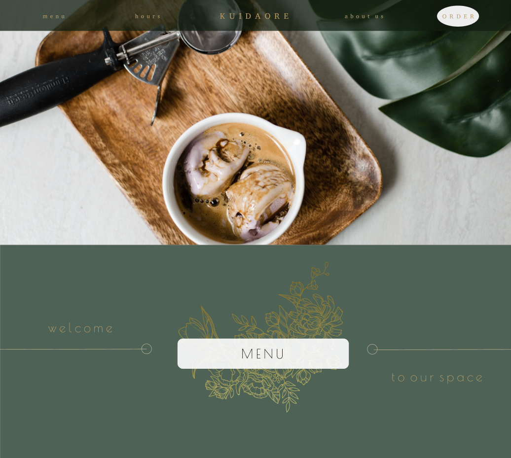
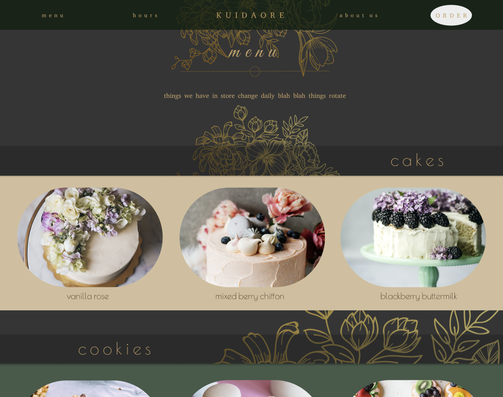

# Kuidaore

|  | Kuidaore is a responsive concept website for a mock bakery; it was created using ReactJS and Bootstrap. It is structured much like a normal restaurant website. |
| --------------------------------------------- | --------------------------------------------------------------------------------------------------------------------------------------------------------------- |

### View

[Here](https://github.com)'s a link to view the live repo

 &nbsp;
